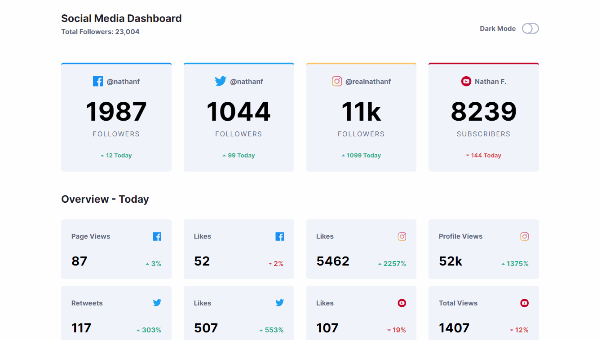

<h1 align="center">Social Media Dashboard built with React</h1>

An example of dashboard UI designed to present social media follower metrics. Follower counts for the social medias fluctuate randomly around their starting value to simulate real change. It has a toggle that allows you to switch between light and dark mode. I built this using React and styled it with Tailwind CSS.

## Links 🌟

- Live site: [Try it out here 💻](https://thethomasy.github.io/social-media-dashboard/ 'Live View')

## Screenshots 📷

  
<!--    -->

## Built With 🛠

- [React JS](https://reactjs.org/)
- [Tailwind CSS (v3.0)](https://tailwindcss.com/)

## Future Updates 🎁

- [ ] Link to an API to get dynamic updates

## Changelog

- **[1.0.0] 17/01/22 Deployment**: Site deployed to GitHub Pages
- **[1.0.1] 27/01/22 Minor fixes**: Title added
---------------------------------------------------------------------
- **[1.1.0] 27/01/22 Random Data**: Follower counts now fluctuate around a starting value and that difference is presented

## Author 🧑

**Tom Young**

- [Github Profile 👨‍💻](https://github.com/TheThomasY)
- [Email ✉](mailto:tomyoungdev@gmail.com?subject=Hi 'Hi!')
- [LinkedIn 💼](https://www.linkedin.com/in/tom-young5555/)
- [Dev.to 🖊](https://dev.to/thetomy)

Give a ⭐️ if you like this project!
